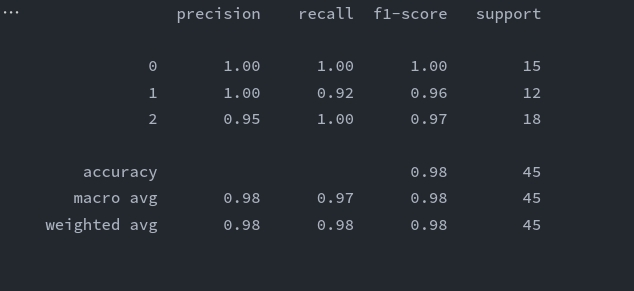

默认参数
| | |
|:-: | :-: |
| hidden_layer_sizes | 20 |
| max_iter | 1000 |
| activation | "relu"|

| | |
|:-: | :-: |
| hidden_layer_sizes | 10 |
| max_iter | 100 |
| activation | "identity"|

| | |
|:-: | :-: |
| hidden_layer_sizes | 100000 |
| max_iter | 100000 |
| activation | "logistic"|

| | |
|:-: | :-: |
| hidden_layer_sizes | 2 |
| max_iter | 10000 |
| activation | "tanh"|

